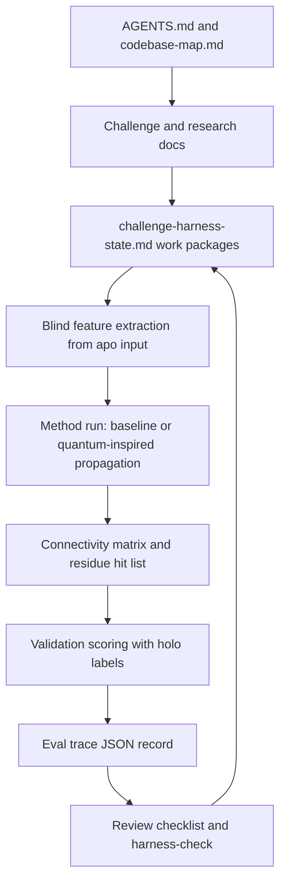

# External Harness Resource Synthesis

本文記錄對 `walkinglabs/awesome-harness-engineering` 收錄外部資源的完整稽核與本 repo 的採納決策。它不是逐字摘要，而是把每個資源轉成此量子挑戰賽 research harness 可執行的設計規則。

## 稽核範圍

稽核時間：2026-05-25。

來源清單：`walkinglabs/awesome-harness-engineering` README，涵蓋以下類別：

- Courses and learning resources
- Foundations
- Context, memory, and working state
- Constraints, guardrails, and safe autonomy
- Specs, agent files, and workflow design
- Evals and observability
- Benchmarks
- Runtimes, harnesses, and reference implementations

外部資源數量會隨 upstream repo 變動。此次稽核以 2026-05-25 讀到的 README 為準，逐項檢視其標題、連結、描述與可取得的正文或 repo README；對 benchmark 與 reference implementation 類資源，重點是抽取可遷移的 harness pattern，而不是把每個工具直接安裝進本 repo。

## Cross-Resource Conclusions

### 1. Harness 是環境設計，不是 prompt 加長

多個來源反覆收斂到同一點：模型外圍的環境、工具、狀態、驗證與安全邊界，會決定 agent 是否能可靠完成長任務。對本 repo 的採納是：

- root `AGENTS.md` 保持短小，作為 map，不作百科全書。
- 深層知識放在 `docs/agent-harness/`、`docs/challenge/`、`docs/research/`。
- 長任務狀態放在 `challenge-harness-state.md`，避免只存在聊天上下文。
- 新方法以 work package 方式進入，不讓 agent 在模糊大目標中自行發散。

### 2. Context 要 progressive disclosure

Context engineering 類資源一致建議把 context window 當成稀缺資源，用 filesystem、索引、manifest、summary、schema 做 just-in-time retrieval。對本 repo 的採納是：

- `codebase-map.md` 是第一層導覽。
- 先讀 summary JSON、manifest、CSV header，再讀大型 PDB/mmCIF/XML。
- 將 validation contact CSV 明確列為 scoring-only context。
- 對大型 structural artifacts 使用 targeted `rg` 或 script parser，不把整檔塞入 context。

### 3. Feedforward guides 和 feedback sensors 必須成對

Thoughtworks 的 guide/sensor 模型、OpenAI 的 repo-local knowledge、Anthropic 的 self-verification、HumanLayer 的 context-efficient backpressure，都指向同一個工程規則：先用文件與 spec 預防錯誤，再用便宜且 deterministic 的檢查讓 agent 自我修正。對本 repo 的採納是：

- Feedforward guides: `AGENTS.md`, nested `AGENTS.md`, challenge details, blueprint, harness state。
- Computational sensors: `make typecheck`, `make analyze`, `git diff --check`, `make harness-check`, `make validate`。
- Inferential sensors: `docs/agent-harness/reviews/code-review-checklist.md` 與後續 domain-expert review prompts。
- 任何反覆出現的錯誤，要升級成文件規則或 deterministic check。

### 4. Safe autonomy 來自最小權限與明確資料邊界

Sandboxing、MCP safety、prompt-injection mitigation、tool design 類資源都強調：agent 要能行動，但工具邊界必須可檢查、可審計、可撤回。對本 repo 的採納是：

- Default setup 和 validation 保持 offline。
- Downloader 是唯一 network-refresh path。
- 不手改 RCSB source artifacts。
- 新外部資料或 challenge portal 查詢必須留下 provenance。
- validation ligand 與 validation structure 不得進入 blind feature extraction。

### 5. Evals 要從小而明確開始

OpenAI、Anthropic、OpenHands、LangChain 的 eval 資源都建議早期先建立小型、可重跑、貼近真實失敗的 eval bank，再逐步擴充；code-based grader 優先，model-based grader 用於語意品質。對本 repo 的採納是：

- `eval-trace.schema.json` 先定義最小 run trace。
- 第一階段 eval 應包含 top-k validation contact hit、random baseline、graph-centrality baseline。
- 每個 method run 需記錄 blind input paths 與 validation paths excluded from features。
- 後續才加入 LLM rubric 來評估 methodological report 的可解釋性與硬體敘述品質。

### 6. Benchmarks 不應直接移植，應借用評估形狀

awesome list 的 benchmark 範圍很廣：coding、terminal、browser、MCP、computer-use、research、planning、多 agent、economics。它們對本 repo 的價值不是直接跑，而是提供評估設計形狀：

- SWE-bench / Terminal-Bench: outcome-based deterministic grading。
- BrowseComp / AssistantBench: long-horizon research needs source quality and coverage checks。
- MCPBench / MCPMark: tool-use quality 要記錄 latency、tool choice、token/cost。
- WebArena / OSWorld: side-effecting tasks 必須 sandbox 並檢查 final state。
- τ-Bench family: policy constraints 和 multi-step state transitions 應可驗證。

本挑戰賽的對應設計是：以 dataset-specific residue ranking 作為 final state，以 validation contact overlap / enrichment / baseline comparison 作為 deterministic graders。

### 7. Reference implementations 給的是 pattern，不是 dependency list

SWE-agent、SWE-ReX、deepagents、AgentKit、Citadel、Harbor、Harness Evolver、Uni-CLI 等資源展示了不同 runtime/harness 做法。對本 repo 的採納是保守的：

- 先不引入重型 agent runtime。
- 用 Makefile、JSON schema、Markdown state、Python scripts 建立可審查的 file-based harness。
- 只有當 method execution 需要隔離、批量 eval、或 multi-agent search 時，才考慮引入更重的 runtime。

## Resource Matrix

| Category | Representative resources reviewed | Adopted pattern |
| --- | --- | --- |
| Course | walkinglabs/learn-harness-engineering | Project-based harness should produce artifacts, not just advice. |
| Foundations | OpenAI harness engineering; Anthropic long-running harnesses; LangChain anatomy; Thoughtworks harness engineering; Inngest harness-not-framework; CAR/HarnessCard paper | Treat repo as system of record; define control, agency, runtime, evaluation boundaries. |
| Context and memory | Anthropic context engineering; Manus context engineering; HumanLayer advanced context/backpressure; OpenHands condensation; CLAUDE.md guidance | Use progressive disclosure, durable task state, concise agent instructions, noise-limited command output. |
| Guardrails and safe autonomy | Anthropic sandboxing; MCP code execution; tool-writing guidance; OpenHands prompt-injection mitigation; Thoughtworks quality/reference-app articles; Claude Code docs; Lurkr | Offline default, explicit network refresh, scoring-only validation labels, tool/result token discipline. |
| Specs and workflow | AGENTS.md; agent.md; GitHub spec-kit; Thoughtworks SDD; 12 Factor Agents; 12-Factor AgentOps | Stable repo-local instructions, explicit work packages, pause/resume state, deterministic control flow before agent freedom. |
| Evals and observability | OpenAI eval skills, agent evals, eval best practices, trace grading; Inspect AI; OpenTelemetry GenAI semconv; AgentOps; agenttrace; OpenHands eval/verification; Anthropic evals/noise; LangChain deep-agent evals | JSON run traces, code-based graders first, track tokens/latency/tool use when available, baseline and regression suites. |
| Benchmarks | AgentBench, SWE-bench, Terminal-Bench, WebArena, OSWorld, BrowseComp, MCPBench, τ-Bench, AppWorld, WorkArena, and related leaderboards | Borrow deterministic final-state grading, task banks, repeated trials, trajectory metrics, and sandboxed side-effect checks. |
| Runtimes | HEAAL, Claude Agent SDK, deepagents, SWE-agent, SWE-ReX, AgentKit, browser-harness, Citadel, Harbor, Harness Evolver, skills.sh, Uni-CLI | Keep current harness file-based; add runtime only when local scripts and Makefile no longer cover the needed loop. |

## Adopted Architecture For This Challenge

## Concrete Configuration Decisions

### Keep

- Keep `make setup`, `make lsp`, `make typecheck`, `make analyze`, `make validate`.
- Keep network refresh outside default setup.
- Keep current Python dependency set minimal until modeling requires more.
- Keep all challenge method state in repo-local Markdown/JSON/Python files.

### Add Now

- `docs/agent-harness/research/external-harness-resource-synthesis.zh-TW.md`: source-grounded synthesis.
- `scripts/harness/check_harness_docs.py`: deterministic harness documentation invariant check.
- `make harness-check`: quick guard for required harness artifacts and internal links.
- Include `make harness-check` inside `make validate`.

### Add Later

- `make eval` once a prediction/scoring script exists.
- `analysis/<dataset_slug>/runs/*.jsonl` run traces matching `eval-trace.schema.json`.
- `docs/agent-harness/eval_task_bank.md` with 20-50 concrete tasks after the first method failures are observed.
- Optional OpenTelemetry-compatible trace fields if method execution starts calling external LLM/agent tools.
- Optional sandboxed runtime only if batch experiments or agent-created method variants become risky.

## Challenge-Specific Eval Shape

Each method should be evaluated as a task over one dataset:

- Input: apo PDB-derived residue contact graph for the declared chain.
- Forbidden input: validation ligand coordinates, validation contact residues, holo-only ligand metadata.
- Output state: matrix path, hit-list path, method report path.
- Deterministic graders: file existence, schema conformance, residue ID validity, top-k validation-contact hits, random baseline enrichment.
- Semantic graders: biological plausibility, quantum metric explanation, noise/coarse-graining claims, hardware path realism.
- Trace metrics: run time, seed, graph size, parameter count, top-k scores, baseline deltas.

## External Sources

Primary upstream list:

- `walkinglabs/awesome-harness-engineering`: <https://github.com/walkinglabs/awesome-harness-engineering>

Representative high-signal sources read during synthesis:

- OpenAI, "Harness engineering: leveraging Codex in an agent-first world": <https://openai.com/index/harness-engineering/>
- Anthropic, "Effective context engineering for AI agents": <https://www.anthropic.com/engineering/effective-context-engineering-for-ai-agents>
- Anthropic, "Demystifying evals for AI agents": <https://www.anthropic.com/engineering/demystifying-evals-for-ai-agents>
- Anthropic, "Code execution with MCP: building more efficient agents": <https://www.anthropic.com/engineering/code-execution-with-mcp>
- Anthropic, "Writing effective tools for AI agents": <https://www.anthropic.com/engineering/writing-tools-for-agents>
- Thoughtworks / Martin Fowler, "Harness engineering for coding agent users": <https://martinfowler.com/articles/harness-engineering.html>
- Thoughtworks / Martin Fowler, "Humans and Agents in Software Engineering Loops": <https://martinfowler.com/articles/exploring-gen-ai/humans-and-agents.html>
- HumanLayer, "12 Factor Agents": <https://www.humanlayer.dev/blog/12-factor-agents>
- HumanLayer, "Context-Efficient Backpressure for Coding Agents": <https://www.humanlayer.dev/blog/context-efficient-backpressure>
- OpenHands, "How to Evaluate Agent Skills": <https://www.openhands.dev/blog/evaluating-agent-skills>
- OpenTelemetry GenAI semantic conventions: <https://opentelemetry.io/docs/specs/semconv/gen-ai/>
